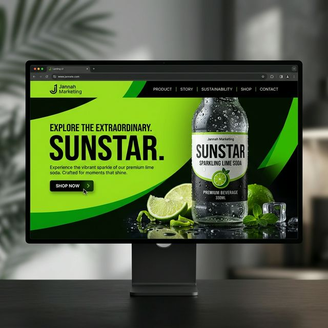

<div align="center">



# Jannah Marketing (Pvt) Ltd
### Feel The Fizz — Premium Beverage Marketing & Distribution

[](https://vitejs.dev/)
[](https://reactjs.org/)
[](https://tailwindcss.com/)
[](https://www.typescriptlang.org/)

</div>

---

## 🚀 Overview

**Jannah Marketing (Pvt) Ltd** is a premier beverage distribution company based in **Sainthamaruthu, Sri Lanka**. This repository contains the high-performance, mobile-first web application for the **Sunstar** brand, focusing on high-impact visuals and native-feeling interactivity.

The site is built with a "Performance-First" philosophy, prioritizing native browser APIs and GPU acceleration over heavy third-party libraries.

## ✨ Key Features

- **🚀 Native-Like Performance**: 0% Framer Motion usage. All animations are handled via high-performance CSS transitions and the GPU compositor.
- **📱 Mobile-First Design**: Tactile touch feedback and fluid scrolling on all mobile devices.
- **🎭 Intersection Observer Reveals**: Smooth, staggered entrance animations as you scroll.
- **🗺️ Interactive Sri Lanka Map**: A custom-built SVG map highlighting distribution hubs across the island.
- **🛡️ Secure Communications**: Integrated with **EmailJS** for instant, reliable contact form and newsletter handling.
- **🔍 SEO Optimized**: Full metadata coverage using `react-helmet-async` for every page.
- **📦 Optimized Build**: Route-based code splitting and manual chunking for minimal initial bundle size (~220kB).

## 🛠️ Tech Stack

- **Core**: React 19, TypeScript
- **Styling**: Tailwind CSS v4 (Modern performance features)
- **Icons**: Lucide React
- **Animations**: Native CSS Transitions, `IntersectionObserver`
- **Analytics**: Cloudflare Web Analytics
- **Deployment & Build**: Vite, PostCSS

## 📂 Project Structure

```text
├── components/          # Reusable UI components (Hero, Story, Products, etc.)
├── pages/               # Route components (Home, About, Shop, Contact, etc.)
├── public/              # Static assets (Favicon, Sitemap, Screenshots)
├── App.tsx              # Main application entry and routing
├── index.css            # Global design system and GPU animation utilities
└── index.tsx            # Root entry point
```

## ⌨️ Development

### Prerequisites
- Node.js (Latest LTS recommended)
- npm or yarn

### Setup
1. Clone the repository
2. Install dependencies:
   ```bash
   npm install
   ```
3. Run the development server:
   ```bash
   npm run dev
   ```
4. Build for production:
   ```bash
   npm run build
   ```

## 📄 License

© 2026 Jannah Marketing (Pvt) Ltd. All Rights Reserved.

---

<div align="center">
  <sub>Built with ❤️ by the Jannah Marketing Team</sub>
</div>
